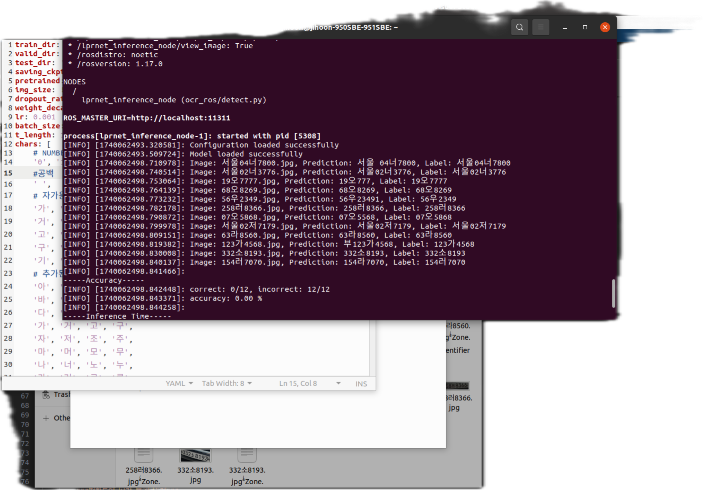

# LPRNet-OCR_ROS

This project provides an implementation of License Plate Recognition (LPR) using the LPRNet model, adapted to run in the ROS (Robot Operating System) environment. The system is designed to recognize vehicle license plates and save the OCR results in JSON format for further use.

Detailed explanations will be added later.

Environment
	•	Ubuntu 20.04
	•	ROS Noetic
	•	Python 3
	•	OpenCV
	•	TensorFlow or PyTorch (depending on the backend used for LPRNet)

Installation

To install and set up the project, follow these steps:
	1.	Clone the repository into your catkin_ws/src directory:
```
cd ~/catkin_ws/src
git clone https://github.com/jihoon7171/LPRNet-OCR_ROS.git
cd ..
catkin_make
source devel/setup.bash  # ROS environment setup
```


# Configuration

Please modify the paths for test_dir, pretrained, and other settings in the ocr_ros.launch file 
# How to Run

To run the system, execute the following commands:
	1.	Launch the system:
```
roslaunch ocr_ros ocr_ros.launch
```

	2.	Run the detection script:
	
```
rosrun ocr_ros detect.py
```

After execution, all results are saved as JSON files in the ocr_ros/save_plate folder in the format: ‘filename: vehicle license plate OCR result.’

# Output

The OCR results will be saved in the ocr_ros/save_plate folder in the following format:
```
'filename: vehicle license plate OCR result'
```

Result in Terminal



#Copyright Notice

This project is not the original creation of the LPRNet model. The original LPRNet model was developed by Intel. The modifications made here allow it to be used within the ROS environment.

For more details on the original technology and licensing, please refer to the official documentation:
Intel - License Plate Recognition using LPRNet Model

# License

This project is licensed under the Apache License 2.0. See the LICENSE file for full details. The Apache License 2.0 allows for both personal and commercial use with certain conditions.